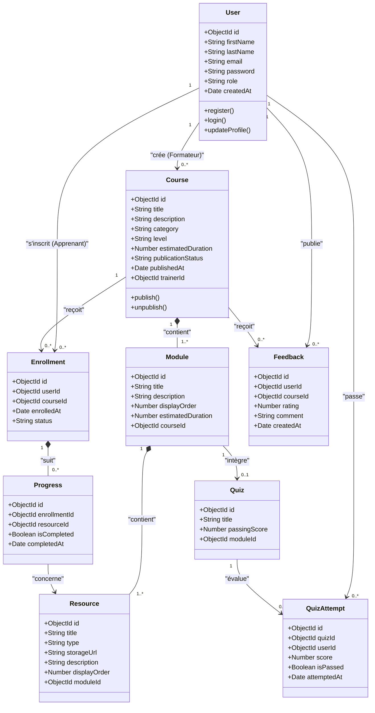
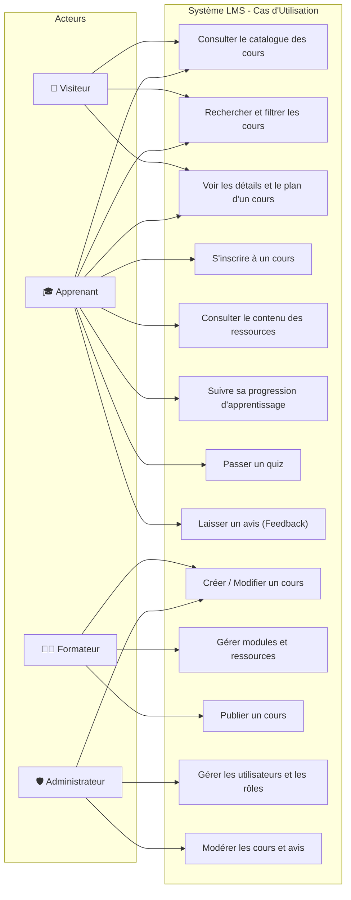
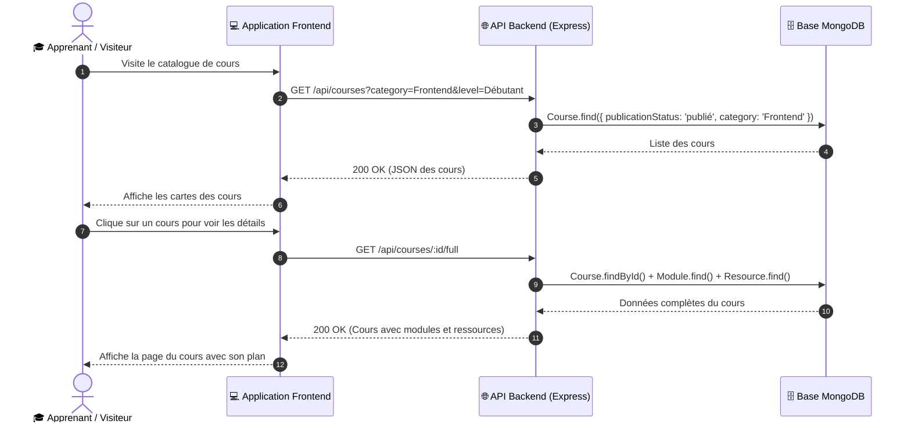

# 📐 Conception & Diagrammes UML du LMS

Ce document présente la modélisation complète du système LMS afin de verrouiller la conception globale dès ce premier sprint.

---

## 1. Diagramme de Classes UML Global

Ce diagramme modélise l'ensemble du domaine fonctionnel :
- Les entités implémentées dans ce sprint : **Course**, **Module**, **Resource**
- Les entités prévues pour les prochains sprints : **User**, **Enrollment**, **Progress**, **Quiz**, **QuizAttempt**, **Feedback**

---

## 2. Diagramme de Cas d'Utilisation (Use Cases)

Ce diagramme présente les interactions des 4 rôles avec la plateforme LMS.

---

## 3. Diagramme Complémentaire : Parcours & Séquence d'Apprentissage

### Diagramme de Séquence : Consultation et Parcours d'un Cours

### 💡 Justification du diagramme complémentaire :
Ce diagramme de séquence permet de clarifier le flux de données entre l'interface utilisateur, l'API Express et la base de données MongoDB. Il sécurise l'implémentation de la route `GET /api/courses/:id/full` et garantit que les données envoyées au client contiennent tous les éléments nécessaires pour construire la vue d'un cours de manière performante.

---

## 4. Règles d'Accès Futures et Justification de la Structure

### 🔐 Règles d'accès futures (Sprint 2) :
1. **Routes Publiques** :
   - `GET /api/courses` (seulement statut 'publié')
   - `GET /api/courses/:id`
   - `GET /api/courses/:id/modules`
2. **Routes Protégées Apprenant** :
   - `POST /api/enrollments` (inscription)
   - `GET /api/modules/:moduleId/resources` (accès aux contenus privés une fois inscrit)
   - `POST /api/progress`
3. **Routes Protégées Formateur / Admin** :
   - `POST /api/courses`, `PUT /api/courses/:id`, `DELETE /api/courses/:id`
   - `POST /api/modules`, `PUT /api/modules/:id`, `DELETE /api/modules/:id`
   - `POST /api/resources`, `PUT /api/resources/:id`, `DELETE /api/resources/:id`

### 🏗️ Justification de la Structure du Projet :
- **Séparation des responsabilités (MVC simplifié)** :
  - `routes/` : Déclare les endpoints et associe les requêtes HTTP aux contrôleurs.
  - `controllers/` : Contient la logique métier pure (recherche, validation, formatage).
  - `models/` : Définit les schémas Mongoose et les règles de validation des données.
  - `middlewares/` : Centralise la gestion des erreurs et des routes introuvables.
  - `config/` : Isole la configuration de la base de données.
- Cette organisation permet une grande lisibilité pour les débutants, évite la duplication de code et facilite les tests et la maintenance.
